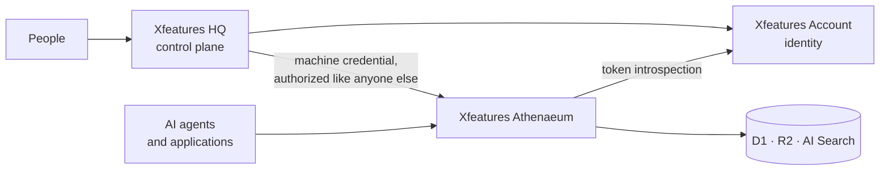
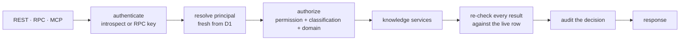
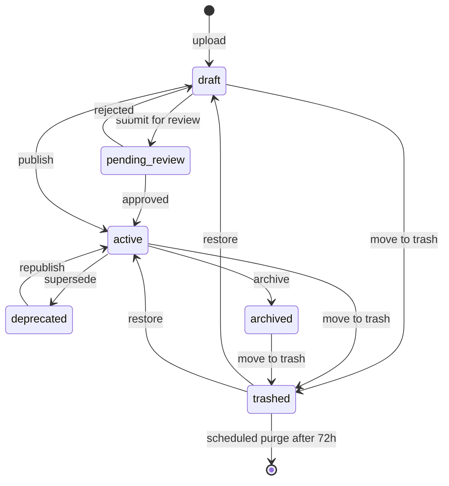

# Xfeatures Athenaeum

**The secure knowledge layer connecting Xfeatures applications, people and AI agents.**

[](https://github.com/XfeaturesGroup/XfeaturesAthenaeum/actions/workflows/ci.yml)
[](https://workers.cloudflare.com/)
[](https://github.com/XfeaturesGroup/XfeaturesAthenaeumMCP)
[](docs/AUTHENTICATION.md)
[](LICENSE)

One authenticated knowledge and retrieval service for every application, person
and AI agent in an organisation. Exact facts live in D1, documents in R2,
semantic retrieval runs through Cloudflare AI Search — and nothing ever talks to
any of those directly.

Callers speak **REST**, **Workers RPC** or **MCP**. Athenaeum resolves who is
asking and what they are allowed to see on every single call, then re-checks
every result against the live database before returning it.

```
Caller ──▶ REST / RPC / MCP ──▶ authenticate ▸ authorize ▸ audit ──▶ D1 · R2 · AI Search
```

> **Source available — proprietary software, not open source.** You may read,
> clone and privately evaluate this code under the
> [Xfeatures Proprietary Source License](LICENSE). Running it as a production
> service, operating it commercially, or redistributing a modified copy
> requires separate written permission. See [Licence](#licence) below.

## Why it exists

Give each agent its own database, its own copy of the docs and its own hand-rolled
RAG pipeline, and you get one knowledge base per agent — each stale in a different
way, none of them access-controlled. Athenaeum is the alternative: one corpus, one
permission model, one audit trail, and per-agent slices of it.

## What it guarantees

- **Identity is never client-claimed.** A caller presents a credential; permissions
  come from Athenaeum's own database, keyed on the verified identity. Editing a
  token's scope gains nothing.
- **Classification and domain are enforced on every call.** A support agent cleared
  for `support` at `INTERNAL` cannot see a `RESTRICTED` document filed under the
  same domain — and never learns it exists.
- **The search index is not authoritative.** Every retrieved chunk is re-validated
  against the live database row before it is returned, so a stale or tampered index
  cannot release content, and a superseded version cannot be served under the
  current one's identity.
- **Retrieved knowledge is evidence, not instruction.** Athenaeum never calls an
  LLM. It returns passages with citations; the calling agent synthesises the answer
  and is responsible for treating that content as untrusted.
- **Publishing needs a human.** An agent can draft a document and submit it for
  review. No transport exposes a way to publish one.
- **Nothing is deleted by hand.** Documents move to trash, are restorable for 72
  hours, and are purged by a scheduled job — never by a button.

## Two kinds of knowledge

Athenaeum stores exact facts and semantic knowledge differently, because they
fail differently.

| | Exact facts | Semantic knowledge |
|---|---|---|
| Example | `plans/annual-pro` price is `299` | "what does our refund policy actually say" |
| Lives in | **D1**, as structured rows | **R2**, as canonical document bytes |
| Retrieved by | Direct lookup on namespace + key | **AI Search**, then re-checked against D1 |
| Answer when unsure | `NOT_FOUND` | `NO_RELIABLE_MATCH` |

An agent that needs a price should never search for one. A number that must be
right is a fact lookup; a passage a person will read is a document. Getting a
plausible-looking wrong price out of a similarity search is exactly the failure
this split exists to prevent.

### What each store is for

- **D1** is the authority. Facts, document metadata, the catalog, agents, roles,
  permissions, quotas and the audit trail. Every access decision is made from D1,
  never from a cache and never from the index.
- **R2** holds canonical document content, one immutable object per version. Keys
  are server-generated and embed classification and domain for human
  browsability — they are explicitly *not* a security boundary, because the
  bucket is never publicly reachable.
- **AI Search** is an index over R2, and nothing more. It is a hint about where
  to look. It is never the authority on what a caller may see.

## Where Athenaeum sits



- **Xfeatures Account** is the identity platform for the Xfeatures ecosystem. It
  answers *who is calling* and nothing else: Athenaeum takes the introspected
  identity and resolves permissions from its own database. An Account token can
  prove who you are and still get you nothing here. (Account is a separate,
  private system; this repository documents the public contract it exposes --
  RFC 7662 introspection -- not its implementation.)
- **Xfeatures HQ** is the control plane where people administer documents, review
  and publish them, and manage access. HQ holds no special standing inside
  Athenaeum — it authenticates with its own machine credential and is authorized
  on every call. Revoking HQ's principal cuts it off without touching its Account
  identity.

## The security model

Five properties, each enforced in code rather than by convention:

1. **Identity is resolved, never accepted.** Permissions come from a fresh D1 read
   keyed on a verified identity, on every call. Nothing a caller sends can widen
   what it may see.
2. **Two independent gates on every read.** A scope permission
   (`documents.read.<domain>`) *and* a classification permission
   (`knowledge.classification.<TIER>`). Holding one without the other denies.
3. **Provenance is recorded, not inferred.** Every document carries its source
   type and reference, every version records who wrote it and why, and every
   authenticated call — allowed or denied — writes an audit event.
4. **Versions are immutable.** Editing appends a version; it never rewrites one.
   Rollback republishes an earlier version *as a new version*. History is
   evidence, so nothing overwrites it.
5. **Current-version reconciliation.** A search hit is only served if the chunk's
   source object is the document's current version *and* the live row still says
   it is active and still carries a classification the caller may see. A stale
   index cannot release a superseded version under the current one's identity,
   and cannot release something archived, reclassified or trashed a moment ago.

Retrieved content is data, never instruction — Athenaeum never calls an LLM. See
[THREAT-MODEL.md](docs/THREAT-MODEL.md) for what these rest on, and
[SECURITY-ASSUMPTIONS.md](docs/SECURITY-ASSUMPTIONS.md) for where they stop.

## Quick start

```bash
TOKEN=$(curl -s https://auth.xfeatures.net/oauth/token \
  -d grant_type=client_credentials \
  -d "client_id=$CLIENT_ID" -d "client_secret=$CLIENT_SECRET" | jq -r .access_token)

curl -s https://athenaeum.xfeatures.net/v1/knowledge/search \
  -H "Authorization: Bearer $TOKEN" -H 'content-type: application/json' \
  -d '{"query": "what is the refund window", "domain": "support"}'
```

Full walkthroughs: [REST](docs/QUICKSTART-REST.md) · [MCP](https://github.com/XfeaturesGroup/XfeaturesAthenaeumMCP)

## Documentation

| Document | What it covers |
|---|---|
| [ARCHITECTURE.md](docs/ARCHITECTURE.md) | How the pieces fit together, and why |
| [AUTHENTICATION.md](docs/AUTHENTICATION.md) | Credentials, gates, revocation, failure modes |
| [OAUTH-PKCE.md](docs/OAUTH-PKCE.md) | Interactive login for people and CLIs |
| [OAUTH-CLIENT-CREDENTIALS.md](docs/OAUTH-CLIENT-CREDENTIALS.md) | Machine login for services |
| [QUICKSTART-REST.md](docs/QUICKSTART-REST.md) | Getting a first result over REST |
| [AGENT-INTEGRATION.md](docs/AGENT-INTEGRATION.md) | Connecting an agent over RPC, REST or MCP |
| [THREAT-MODEL.md](docs/THREAT-MODEL.md) | What this defends against, and how |
| [SECURITY-ASSUMPTIONS.md](docs/SECURITY-ASSUMPTIONS.md) | What the guarantees depend on |
| [LOCAL-DEVELOPMENT.md](docs/LOCAL-DEVELOPMENT.md) | Running it on your machine |
| [DEPLOYMENT.md](docs/DEPLOYMENT.md) | Standing up an environment |
| [openapi.yaml](docs/openapi.yaml) | Full REST surface, checked against the route table in CI |

## Connecting to it

This repository is the service. The developer-facing surfaces live in their own
repositories, so each has its own README, examples and release cadence:

| Repository | Use it when |
|---|---|
| **[XfeaturesAthenaeumMCP](https://github.com/XfeaturesGroup/XfeaturesAthenaeumMCP)** | You are connecting an AI agent over the Model Context Protocol. Endpoint, both token flows, the nine tools and a connection probe. |
| **[XfeaturesAthenaeumSDK](https://github.com/XfeaturesGroup/XfeaturesAthenaeumSDK)** | You are writing TypeScript and want a typed client. Dependency-free; the types live in the same package. |
| **[XfeaturesAthenaeumCLI](https://github.com/XfeaturesGroup/XfeaturesAthenaeumCLI)** | You want to search from a terminal. Signs in with PKCE, no secret to configure. |

The **MCP server implementation stays here**, in `src/mcp/`, because it shares
one authenticate → authorize → audit pipeline with REST and Workers RPC. The MCP
repository is the client-facing half: how to connect and what the tools do.
REST is likewise implemented here — the SDK is its client, so there is no
separate REST server repository to maintain.

## How a request is decided



The same code runs for all three transports. There is no looser ACL for MCP or for
"internal" callers.

## Document lifecycle

Documents are immutable at the version level. Editing writes a new version; it
never rewrites history. Rollback republishes an earlier version as a new one.



Trash is not a delete button with a delay. A trashed document leaves every
retrieval surface immediately — HQ, REST, MCP — and any AI Search hit for it is
rejected by the live database check. After 72 hours a scheduled job purges the
canonical content and its historical objects, while the audit trail stays.

## Development

```bash
npm install
npm run typecheck && npm run lint && npm test
```

Tests run inside the real Workers runtime via `@cloudflare/vitest-pool-workers`.
Integration tests apply the real migrations to a Miniflare-backed D1 per run, and a
set of source-inspection tests fail the build if, for example, a new admin route is
added without a permission gate.

To run the service locally, see [LOCAL-DEVELOPMENT.md](docs/LOCAL-DEVELOPMENT.md).

## Security

Please do not open a public issue for a security problem — see
[SECURITY.md](SECURITY.md) for private reporting.

The central claim is that a fully compromised low-privilege agent, valid credential
and all, still cannot read, modify or destroy anything outside its own permission
set, and cannot escalate to a stronger identity. The
[threat model](docs/THREAT-MODEL.md) says what that rests on;
[SECURITY-ASSUMPTIONS.md](docs/SECURITY-ASSUMPTIONS.md) says where it stops.

This codebase has been through an internal adversarial review, with a regression
test for each finding verified to fail against the vulnerable code. That is not a
substitute for an independent penetration test, and it is not a claim that the
system is free of defects.

## What is not built

Being direct about the edges rather than implying more than is there:

- **PDF ingestion.** No verified-safe in-Worker PDF text extraction is wired up;
  convert to Markdown or plain text upstream.
- **Ad-hoc role and permission editing.** Roles are fully modelled and seeded, and
  agent creation grants them, but there is no CRUD surface for editing them after
  the fact.
- **Admin list views** for facts, products, plans, services and policies. Create and
  update exist; paginated "list everything of type X" does not.
- **A caching layer.** Deliberately absent. AI Search's own response cache is
  disabled, because its cache-key contract with respect to per-agent classification
  and domain filters is not documented — and without that, "one agent's cached
  result can never reach a differently-scoped agent" is not provable.
- **Bulk operations.** No bulk publish, bulk trash, or bulk purge.

## Licence

**Source available — proprietary software, not open source.**

This repository is licensed under the
[Xfeatures Proprietary Source License](LICENSE), not MIT, Apache, GPL or any
OSI-approved license. In short:

| You may, without asking | You may not, without written permission |
|---|---|
| Read, clone and study the source | Run it as a production service, for yourself or anyone else |
| Evaluate it privately, non-production | Offer it, or a derivative, as a hosted or managed service |
| Fork it through GitHub's own functionality | Sell, sublicense or relicense it |
| Do responsible security research (see [SECURITY.md](SECURITY.md)) | Distribute a modified copy, or strip its notices |
| — | Use it, or a substantial part of it, to build a competing platform |

Full terms, including the security-research carve-out and how to request a
commercial license, are in [LICENSE](LICENSE).
