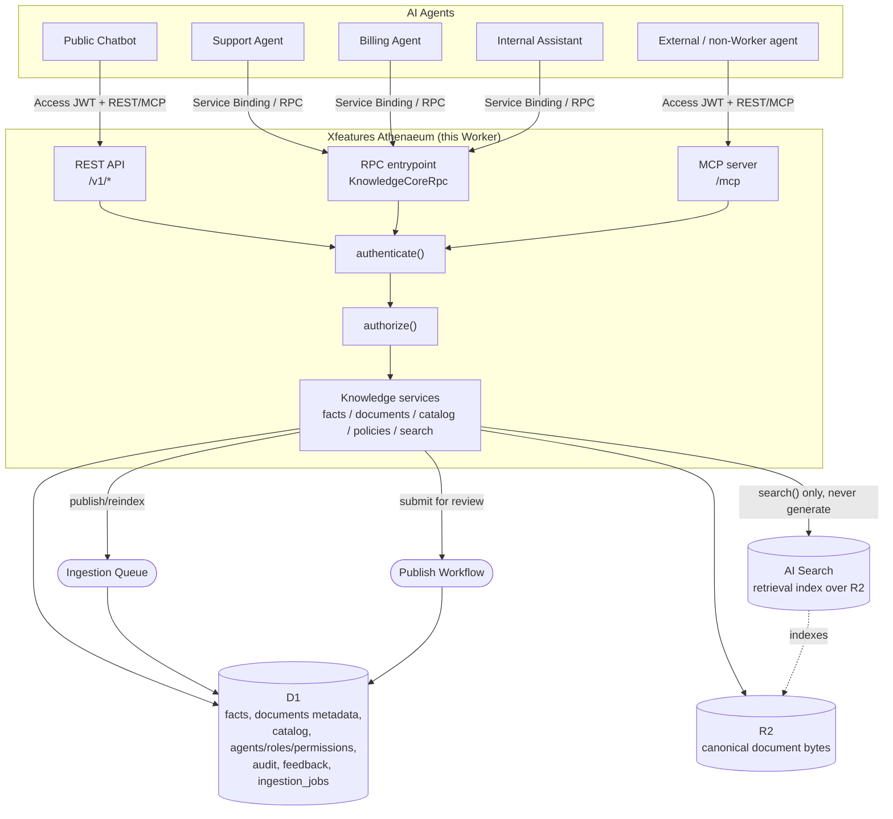
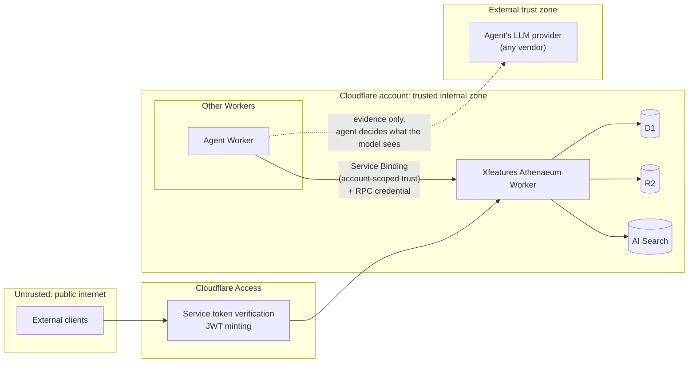
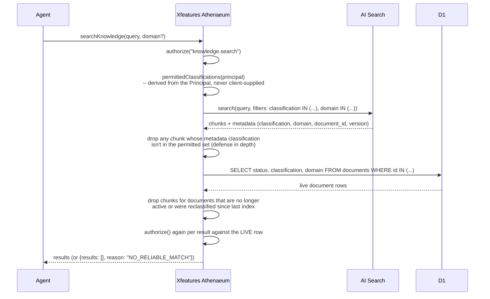
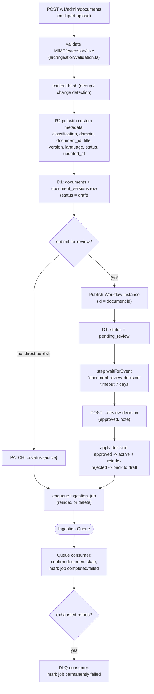

# Architecture

## System overview



Every arrow into `authn`/`authz` is the *same* code path (`src/auth/pipeline.ts`) regardless of which of the three edges it came in on. There is no separate, looser ACL for MCP or RPC callers.

## Trust boundaries



Xfeatures Athenaeum never talks to an LLM provider and never sees which model an agent uses (model-agnostic). It hands back evidence; the calling agent decides what — if anything — reaches its model's context window, and is responsible for its own prompt-injection-aware handling of that evidence (reinforced by the `EVIDENCE_NOTICE` string that ships inside every MCP tool result and every REST/RPC response's implicit "this is retrieved data" contract).

## Authentication flow

```mermaid
sequenceDiagram
    participant Caller
    participant Ath as Xfeatures Athenaeum
    participant Account as Xfeatures Account
    participant D1

    alt Bearer token (REST or MCP) -- the usual path
        Caller->>Ath: request + Authorization: Bearer <token>
        Ath->>Account: POST /oauth/introspect (Athenaeum's own client credentials)
        Account-->>Ath: {active, client_id, sub, scope}
        Ath->>Ath: require the `athenaeum` scope,<br/>or the one pre-registered Developer Access client with a subject
        Note over Ath: a positive result is cached for at most 60s;<br/>a negative one is never cached
    else Cloudflare Access JWT
        Caller->>Ath: request + Cf-Access-Jwt-Assertion
        Ath->>Ath: verify signature via JWKS, check iss + aud
    else Internal Worker (Service Binding / RPC)
        Caller->>Ath: RPC call + {agentKey, rpcKey}
        Ath->>Ath: timing-safe compare against the stored peppered hash
    end

    Ath->>D1: SELECT * FROM agents WHERE ... AND environment = <this Worker's ENVIRONMENT>
    D1-->>Ath: agent row (or none)
    alt unknown, disabled, revoked, wrong environment, or any lookup error
        Ath-->>Caller: 401 UNAUTHENTICATED (fail closed)
    else active agent
        Ath->>D1: agent_roles -> role_permissions -> permissions
        D1-->>Ath: permission set
        Ath->>Ath: build Principal {agentId, agentKey, environment, permissions}
    end
```

The environment check in that D1 lookup is load-bearing: an agent row's
`environment` must equal the Worker's own, so a development credential cannot
authenticate against production even if it leaks.

Client-claimed roles are never trusted — the JWT/RPC credential only proves *identity*; every permission comes from a fresh D1 read keyed off that identity.

## Retrieval (search) flow — ACL before retrieval



The pre-filter sent to AI Search is the primary gate; the live-D1 cross-check afterward is a second, independent gate against index staleness — a document archived or reclassified a minute ago can't leak through a not-yet-refreshed index entry. Neither gate alone is trusted as sufficient.

## Ingestion / publish flow



AI Search re-indexes the R2 bucket on its own schedule once metadata is written — Xfeatures Athenaeum doesn't (and, as far as this build could verify, can't) force a synchronous re-index via the Workers binding. That's exactly why the retrieval flow above never trusts the index alone for freshness.

## Data model

`facts` and `documents` are the two content types with full point-in-time version history (`fact_versions`, `document_versions`) since those are the ones the spec calls out for rollback/audit by name. `products`, `plans`, `services`, and `policies` bump an in-place `version` integer and rely on `audit_events.old_value_json`/`new_value_json` for history instead — four more near-duplicate `*_versions` tables would be a lot of repetitive schema for a need `audit_events` already covers. See the header comment in [`migrations/0001_init.sql`](../migrations/0001_init.sql) for the full column-level design notes.

Full ERD-level detail lives in the migration file itself (it's the source of truth); this doc stays intentionally high-level so it doesn't drift out of sync with the schema.

## Why these Cloudflare products and not others

- **AI Search over hand-rolled Vectorize + embeddings**: the point of Xfeatures Athenaeum is being replaceable (of the design brief: "keep the architecture replaceable") — AI Search's `KnowledgeSearchProvider` abstraction (`src/search/types.ts`) is one implementation; swapping engines later doesn't touch any caller.
- **No Durable Objects**: nothing here needs strongly-coordinated state, locking, or WebSockets — not rate limiting (native Workers Rate Limiting API instead), not MCP sessions (stateless Streamable HTTP), not ingestion coordination (Queues' own retry/DLQ semantics).
- **Workflows only for the publish-approval gate**: plain ingestion (parse/hash/store/index) is a simple idempotent Queue consumer; only the "wait for a human, possibly for days" step genuinely needs Workflows' durability.
- **KV isn't used at all**: nothing here is a good fit for eventually-consistent, low-write-latency cache-style storage over D1's strong consistency, and, KV must never be the backing store for permissions or classification decisions anyway.
