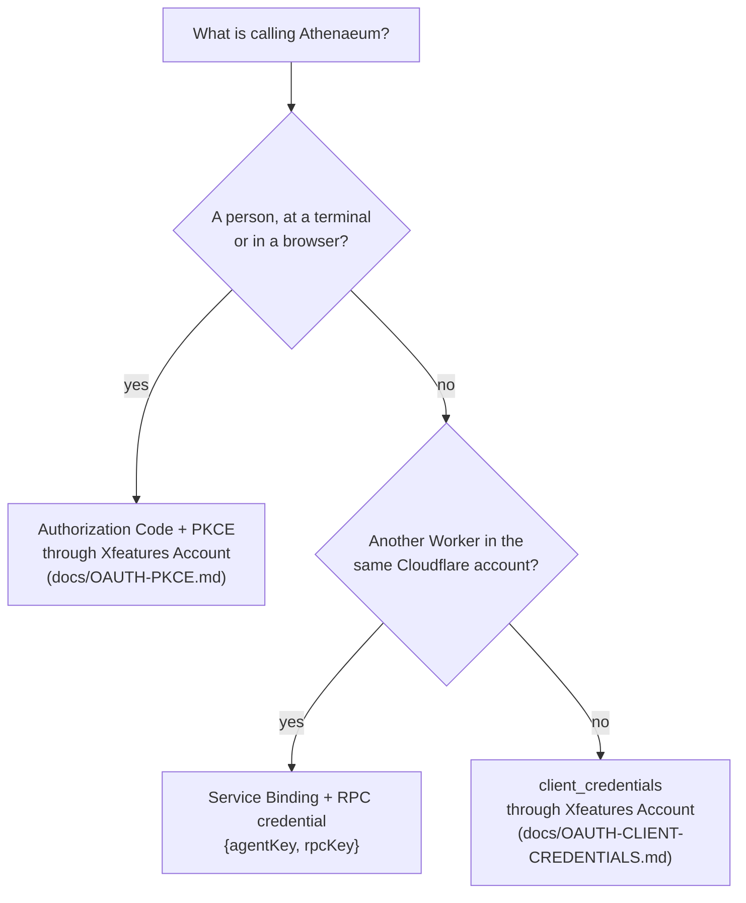

# Authentication

Athenaeum answers three transports — REST, Workers RPC and MCP — and every one of
them goes through the same code (`src/auth/pipeline.ts`). There is no looser path
for MCP, and none for "internal" callers. What changes between transports is only
how a credential is presented.

## Which credential do I need?



## The two things a credential must prove

Authentication answers *who is calling*. It never answers *what they may see* —
that is resolved separately, from Athenaeum's own database, on every single call.
A token cannot carry its own permissions, so editing one gains nothing.

Concretely, an Account token must clear two gates before Athenaeum will even look
up a principal:

1. **The ecosystem gate.** The token carries the `athenaeum` scope. This is coarse
   and grants no knowledge access by itself; lacking it means the caller was never
   meant to reach Athenaeum at all. Account only ever unions this scope into a
   token through the `client_credentials` grant, which is restricted to
   applications registered as `app_type: "service"`.
2. **The Athenaeum principal.** The introspected `client_id` (or, for a
   user-delegated token, the subject) must match an `agents` row that is `active`.
   Unknown, disabled or revoked all resolve to `UNAUTHENTICATED`.

Because a human's own Account login can never carry the `athenaeum` scope — the
grant that produces it has no consent screen and no subject — interactive access
goes through one narrower door instead: a token from the single pre-registered
**Athenaeum Developer Access** application, carrying a subject. Every other
application, no matter who owns it, still needs the scope.

## Discovery

Athenaeum is a **resource server**. It hosts no `/authorize`, issues no tokens,
and proxies neither — it publishes RFC 9728 metadata naming the authorization
server, and a client continues from there. A generic MCP client walks the chain
in five steps, with no out-of-band configuration beyond a client_id:

**1. Ask Athenaeum who protects it.** An unauthenticated `/mcp` request answers
`401` with `WWW-Authenticate: Bearer resource_metadata="…"`, pointing here:

```bash
curl https://athenaeum.xfeatures.net/.well-known/oauth-protected-resource
```

```json
{
  "resource": "https://athenaeum.xfeatures.net",
  "authorization_servers": ["https://api.account.xfeatures.net"],
  "bearer_methods_supported": ["header"],
  "scopes_supported": ["openid", "profile:username", "email"]
}
```

**2. Read the issuer.** `authorization_servers[0]` is an explicitly configured
issuer identifier (`ACCOUNT_ISSUER`), not an inference from whichever hostname
Athenaeum happens to introspect tokens against. Those are different contracts
and, in production, different hostnames.

**3. Fetch that issuer's own RFC 8414 metadata.**

```bash
curl https://api.account.xfeatures.net/.well-known/oauth-authorization-server
```

```json
{
  "issuer": "https://api.account.xfeatures.net",
  "authorization_endpoint": "https://account.xfeatures.net/oauth/authorize",
  "token_endpoint": "https://api.account.xfeatures.net/oauth/token",
  "code_challenge_methods_supported": ["S256"],
  "token_endpoint_auth_methods_supported": ["none", "client_secret_post", "client_secret_basic"]
}
```

The `issuer` here must equal the string in step 2 byte for byte — a client is
required to check that (RFC 8414 §3.3), and Account reports the same canonical
issuer on both of its hostnames so the check passes either way.

**4. Send the person to the authorization endpoint** — a page in the Account web
app, on a different origin from the issuer, which is allowed and deliberate:
signing in is a browser experience, issuing tokens is an API.

**5. Redeem the code at the token endpoint** with the PKCE verifier and no
client secret. There is no `registration_endpoint`: Dynamic Client Registration
is not supported, so a client uses the client_id it was configured with.

## Presenting a token

Bearer, in the header. Query-string tokens are not accepted — they end up in logs
and referrers.

```bash
curl -H "Authorization: Bearer $TOKEN" \
     https://athenaeum.xfeatures.net/v1/knowledge/search \
     -H 'content-type: application/json' \
     -d '{"query": "refund window"}'
```

## Worker-to-Worker (RPC)

A Service Binding proves only that *some* Worker in the account was configured to
call Athenaeum. It carries no identity, so it is not treated as one. The calling
Worker also presents `{agentKey, rpcKey}`; Athenaeum compares `rpcKey` against a
peppered SHA-256 hash with a timing-safe comparison. The RPC key is shown once, at
agent creation, and only its hash is stored.

## Revocation, and its window

Permissions are read fresh from D1 on every call, so a permission change or an
agent revocation in Athenaeum takes effect on the next request with no cache to
clear.

Account token introspection is different: a *positive* introspection result is
cached for at most 60 seconds. Revoking a principal at Account therefore takes
effect within that window rather than instantly. This is deliberate — introspecting
on every call would make Athenaeum unavailable whenever Account is — and it is
tested and documented rather than accidental. Negative results are never cached, so
an outage cannot pin a legitimate caller into denial.

## What failures look like

| Situation | Response |
|---|---|
| No credential, or one that fails introspection | `401 UNAUTHENTICATED` |
| Valid token, missing the `athenaeum` gate | `401 UNAUTHENTICATED` |
| Valid principal, lacks permission for a **write** | `403 FORBIDDEN` |
| Valid principal, lacks permission for a **read** | `404 NOT_FOUND` |

That last row is intentional. A `403` on a read would confirm that a document you
are not cleared to know about exists. Denials are audited either way.
