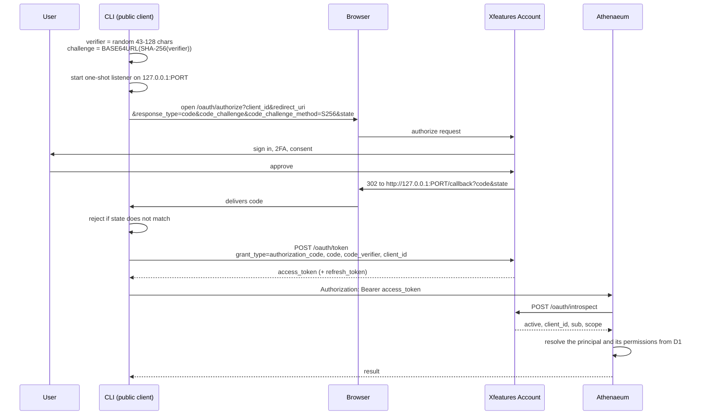

# Interactive login — Authorization Code with PKCE

This is how a **person** gets an Athenaeum token: a CLI, a desktop tool, or any
client that cannot keep a secret. It follows RFC 7636 (PKCE) and RFC 8252 (native
apps), and the shipped `athenaeum` CLI is a working reference implementation —
[the CLI's oauth-flow.ts](https://github.com/XfeaturesGroup/XfeaturesAthenaeumCLI/blob/main/src/oauth-flow.ts).

Because the client is public, it is registered with Account as
`token_endpoint_auth_method: "none"`. There is no client secret anywhere in this
flow, and PKCE is what stops an intercepted authorization code from being redeemed
by anyone else.

## The flow



## Doing it by hand

```bash
# 1. Make a verifier and its challenge.
VERIFIER=$(openssl rand -base64 60 | tr -d '\n=+/' | cut -c1-64)
CHALLENGE=$(printf '%s' "$VERIFIER" | openssl dgst -binary -sha256 | openssl base64 | tr '+/' '-_' | tr -d '=\n')
STATE=$(openssl rand -hex 16)

# 2. Open this in a browser and sign in.
echo "https://account.xfeatures.net/oauth/authorize?client_id=$CLIENT_ID&redirect_uri=http://127.0.0.1:8976/callback&response_type=code&code_challenge=$CHALLENGE&code_challenge_method=S256&state=$STATE"

# 3. Exchange the code the redirect brings back.
curl -s https://auth.xfeatures.net/oauth/token \
  -d grant_type=authorization_code \
  -d "code=$CODE" \
  -d "code_verifier=$VERIFIER" \
  -d "client_id=$CLIENT_ID" \
  -d "redirect_uri=http://127.0.0.1:8976/callback"
```

Or just let the CLI do all of it:

```bash
npx @xfeaturesgroup/athenaeum-cli login
```

## Details worth getting right

- **Redirect to loopback, not to a hosted page.** `127.0.0.1` on an ephemeral port,
  captured by a listener the CLI starts and shuts down immediately. A hosted
  redirect would mean trusting a page the client does not control with the code.
  Prefer the literal `127.0.0.1` over `localhost`, which can resolve to IPv6 and
  miss an IPv4-only listener.
- **`state` is not optional.** Generate it randomly, compare it on return, and
  refuse a mismatch. It is what makes a CSRF-ed callback inert.
- **`S256`, never `plain`.** A `plain` challenge is the verifier, so an attacker who
  sees the authorize request can replay it.
- **The verifier never leaves the client** until the token exchange, and never
  travels in the browser.

## What this token can do

It authenticates you as a person, through the pre-registered **Athenaeum Developer
Access** application. What you may then read or write is decided by the Athenaeum
permissions attached to your principal — not by anything in the token, and not by
who owns the application. See [AUTHENTICATION.md](AUTHENTICATION.md).
